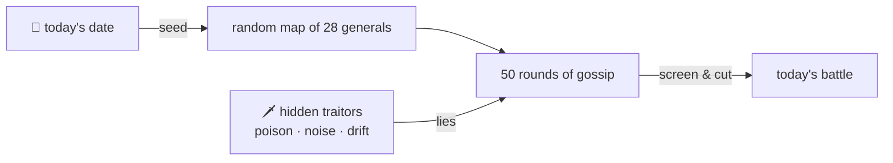

### Hey 👋 I'm Murtaza

PhD researcher at the University of Melbourne, working where **distributed systems** meet **machine learning**. Previously a software engineer at Goldman Sachs.

[Website](https://murtaza-hatim.com/) · [Google Scholar](https://scholar.google.com.au/citations?user=4CNDsBYAAAAJ) · [LinkedIn](https://www.linkedin.com/in/murtazahrangwala/) · [X](https://x.com/Murtaza_talks) · [Medium](https://medium.com/@murtazahatimr/)

---

#### ⚔️ Today's battle

Every day a fresh army of generals tries to agree on a plan while a few traitors hide among them.

<!-- QUORUM:START -->
<div align="center">


### The army split — no single plan

24 loyal generals · 4 hidden traitors · tactic: **noise** — sends a fresh random value to each target, every round

Traitors unmasked **3/4** by round 49 · loyal links cut by mistake **10** · final disagreement **0.279** · distance from the honest average **0.040**

<sub>simulated 2026-09-28 · seeded by the date, so every day is a new battlefield</sub>

</div>
<!-- QUORUM:END -->

---

<details>
<summary>What is this?</summary>

<br>



It's a toy version of the [Byzantine Generals Problem](https://en.wikipedia.org/wiki/Byzantine_fault): how do parties that can only message their neighbours agree on something when some of them lie?

- **The map.** 28 generals are scattered at random and can only talk to generals within range. Each loyal general starts with its own plan (a number, drawn as a colour).
- **Gossip.** Every round, each loyal general averages its plan with the messages it trusts. With no traitors, everyone would end up on the same colour.
- **Traitors.** 3–6 generals are secretly Byzantine. They use one tactic per day: *poison* (a fixed extreme value), *noise* (random values), or *drift* (a believable value with a small bias). Traitors always make up less than a third of any loyal general's neighbourhood, echoing the classic *n > 3f* bound.
- **Defence.** Each general ignores messages that stray too far from its neighbourhood's median. After an 8-round grace period, a neighbour flagged 5 rounds in a row is cut for good. Once all its loyal neighbours have cut it, a traitor is unmasked.

The defence is deliberately simple, and it isn't perfect. Some days a drifting traitor slips through, or a loyal general gets cut by mistake. The stats under the animation report what actually happened. A GitHub Action reruns it daily, seeded by the date.

[See the code →](./quorum)

</details>

<details>
<summary>More about me</summary>

<br>

```yaml
based_in: Melbourne, Australia
now: PhD, Engineering & IT @ University of Melbourne
before:
  - Software Engineering Analyst @ Goldman Sachs
  - Summer Analyst, full-stack & quant dev @ Goldman Sachs
  - Software Architect Intern @ Photobook Worldwide
studied: Bachelor of Software Engineering (Honours) @ Monash University
```

Research and publications live on [my website](https://murtaza-hatim.com/) and [Google Scholar](https://scholar.google.com.au/citations?user=4CNDsBYAAAAJ).

</details>
